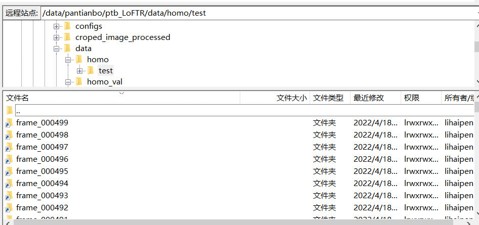
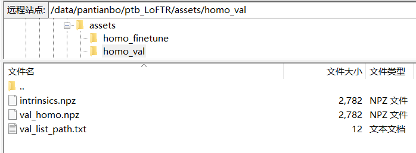
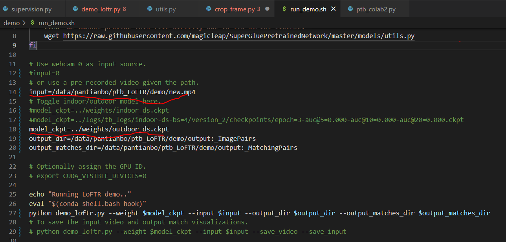

# LoFTR-MedicalData
Compare to the author's original work： [LoFTR](https://github.com/zju3dv/LoFTR#readme)  
Make `weights/` folder using:
```shell
mkdir weights
```
Download the provided ckpts in the [download link](https://drive.google.com/drive/folders/1DOcOPZb3-5cWxLqn256AhwUVjBPifhuf?usp=sharing) to 
  - 4 pretrained models of indoor-ds, indoor-ot, outdoor-ds and outdoor-ot (each ~45MB).
# Finetune
Use the `create_homo_data/Process_data.py` to process each frame to get the folder 'xx_processed'  
### Set the soft links in data/homo/test by using:  
```shell
ln -s train_processed/* data/homo/test/
ln -s val_processed/* data/homo_val/test/
```
After adding soft links:
  

### Make the intrinsics.npz  
- Using the `create_homo_data/get_intrinsics.py` to make the `intrinsics.npz` and `homo_finetune.npz`(they are same)  
- put the `intinsics.npz` and `homo_finetune.npz` into `assets/homo_fientune`  
- the content of homo_list_path.txt is the filename of `homo_finetune.npz`  
:triangular_flag_on_post: val_homo is also treated in the same way. Shown below:

### The checkpoints you trained are in `logs/`
# Test checkpoint
### Input video to test  
Change the `input` and `model_ckpt` of the `run_demo.sh`.  

After that:  
```shell
cd demo/
./run_demo.sh
```  
Alignment results in `demo/output:_ImagePairs`  
Matches are in `demo/output:_MatchingPairs`
### Input image pairs to test  
Change the `img0_pth` and `img1_pth` to the path of the image pair to be aligned  in the `ptb_colab2.py`
```shell
python ptb_colab2.py
```
